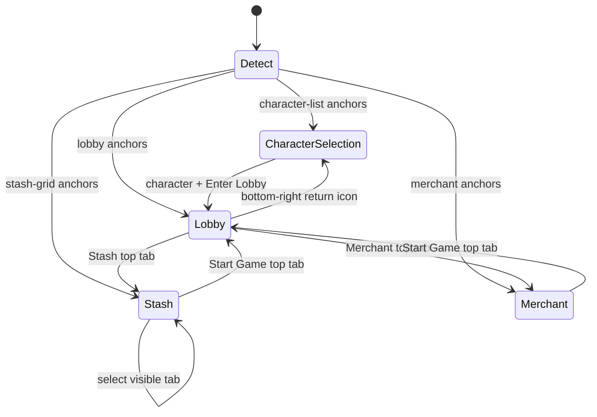

# Game navigation coordinates and offline state machine

This module turns the confirmed 1920×1080 screenshots into client-relative coordinates and a fail-closed navigation plan. It does not send input. A Windows adapter may execute a returned click only after it identifies the foreground game screen and must confirm the expected screen before continuing.

## Coordinate provenance

The stash grid, bag grid, cell pitch, first stash tab, tab spacing, 1280×720 override, and ultrawide scaling match DnDTools commit `dbbb4d3ed547b510b780edcbfd013b91f25c74ee` (`UI/src/models/macros.py`). The supplied screenshots confirmed the remaining 1920×1080 controls.

| Control | Reference coordinate |
|---|---:|
| Start Game / lobby top tab | `(240,41)` |
| Stash top tab | `(880,41)` |
| Merchant & Service top tab | `(1040,41)` |
| Lobby return-to-character-selection icon | `(1856,1016)` |
| Enter Lobby | `(960,1000)` |
| Character-list next page | `(1758,875)` |
| Character cards C1…C6 | `(1696, 177+120×index)` |
| Stash grid outer top-left | `(1378,199)` |
| Player bag grid outer top-left | `(690,626)` |
| Stash tabs T0…T9 | `(1328, 211+45×index)` |

The visible stash-tab count is validated as 2–10 and is supplied by the current character/container profile. The state machine does not use DnDTools's old fixed count of eight or its old inventory-ID ordering.

## Scaling

- At aspect ratios no wider than 16:9, point anchors use independent X/Y scaling from 1920×1080; grid cell and tab spacing scale by height, matching DnDTools.
- On wider displays, a centered 16:9 viewport is scaled by client height and receives a horizontal pillarbox offset.
- The DnDTools 1280×720 hand-tuned stash values are retained.
- The game client window origin is added after scaling. A changed client rectangle invalidates any prepared move through the existing calibration gate.

## State machine

Every click step binds its required screen, expected screen, screen point, timeout, and—where applicable—the expected selected character or stash tab. Unknown screens, unexpected screens, stale confirmations, missing selection evidence, and timeouts block the machine. There is no automatic retry.

## Next live checkpoint: NAV-001

The next local checkpoint is navigation-only and must remain separate from MOVE-003:

1. Run a non-clicking overlay/preview for the scaled points at the current client bounds.
2. With the human present, navigate `Lobby → Stash → Lobby → Character Selection → same character → Lobby → Stash`.
3. Do not drag items, switch marketplace controls, inject packets, or retry automatically.
4. Record screen-transition observations plus whether a complete command-44 state arrives after the automated reselection path.
5. Stop on the first coordinate, focus, screen-detection, timeout, or capture mismatch.
