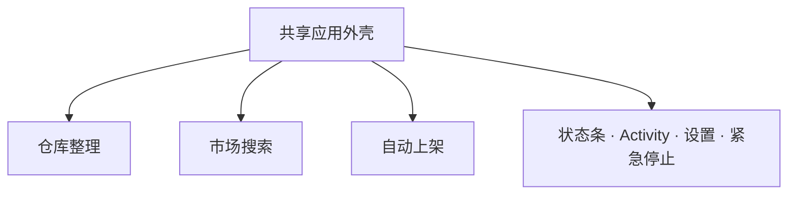

# Dark and Darker Companion 三标签页产品与开发计划

状态：产品/技术计划，不包含本次功能实现  
日期：2026-09-01  
当前分支：`codex/marketplace-search-filter-analysis`  
实现基线：`codex/complete-stash-sort-offline` @ `5985770cead27cd569c74cd7e91ae2039999b1e2`

实施状态：**Phase P0、Marketplace M1 与 M2 已完成；下一步连续完成 Marketplace M3–M5。之后再进行仓库 operator 产品化集成与 Electron。**

## 0. 目标与范围

最终工具只有三个主要工作流标签页：

1. **仓库整理 / Stash Sort**：读取游戏仓库状态，生成可审查的整理计划，并在通过安全检查后执行拖拽整理。
2. **市场搜索 / Marketplace Search**：用户点击“搜索”后，从 DarkerDB 拉取一批 listing，在 Companion 内进行高级本地筛选；用户根据结果自行在游戏 Marketplace UI 中搜索和购买。
3. **自动上架 / Auto Listing**：从玩家拥有的物品中建立待上架队列、生成/调整价格、人工复核，并在未来单独授权后执行和验证上架操作。

`Settings` 不再是第四个主标签页。语言、DarkerDB、捕获、坐标校准、自动化安全和诊断设置放入全局设置抽屉/页面，通过右上角齿轮进入。

本计划统一三个标签页的 UI、共享状态、数据边界、开发顺序和验收标准。当前优先完整完成 Marketplace Search（M2–M5）。Marketplace 仅需要 DarkerDB HTTP、缓存和本地计算，因此继续使用 React/Vite 浏览器开发与验收，不依赖 Windows operator 或 Electron。完成 Marketplace 后，再把已经通过 live 验证的仓库 Refresh/Preview/Run Sort operator 接入产品外壳，并建立桌面宿主边界。当前仍不启动 live 自动上架。

## 1. 已锁定的产品决定

### 1.1 Marketplace Search 的产品边界

- Companion 只搜索 DarkerDB 数据，不操作游戏 Marketplace。
- 用户从 Companion 结果中看到符合条件的物品/listing，然后自己在游戏 UI 中按物品名、品质、词条和价格搜索。
- 不提供自动购买、自动点击市场过滤器、自动翻页、自动选中 listing 或自动成交。
- 结果中的“游戏内搜索信息”是说明/复制辅助，不保证目标 listing 仍存在。
- Marketplace Search 与 Auto Listing 是两个独立状态机、独立队列和独立安全边界。

### 1.2 六项 Marketplace 决定

| # | 决定 | 最终规则 |
| --- | --- | --- |
| 1 | 多职业语义 | 组内 OR：物品可被任意一个所选职业使用即通过；无职业限制物品也通过 |
| 2 | 物品名称粒度 | 选择 Arcane Garb 这样的物品族；品质单独选择；内部解析为具体规范 item IDs |
| 3 | 默认拉取预算 | 每次点击搜索最多 20 个 live 请求、最多取回 1,000 条 listing；“加载更多”再显式消耗一批有界预算 |
| 4 | API 与本地筛选 | 每个 Market API 请求拉回某个严格候选集合；随后在本地完成职业/类别/高级类型/K-of-N 等剩余过滤。结果行不逐条调用 Price Check |
| 5 | 价格排序/展示 | 默认按单位价升序；堆叠物品同时显示单位价和整组总价 |
| 6 | 请求触发 | 只有用户点击“搜索”才发起新的 Marketplace live 查询；编辑条件、展开结果和切换语言都不自动调用 API |

### 1.3 Marketplace API 触发的精确定义

用户点击“搜索”后：

1. 使用本地/缓存的规范目录解析职业、类别、栏位、品质和物品族。
2. 构建最少数量且语义安全的 DarkerDB Market 请求。
3. 每个请求取回一批 active listings。
4. 合并并按 listing ID 去重。
5. 本地复核所有目录条件。
6. 本地计算 K-of-N 词条规则。
7. 按单位价、时间和稳定 ID 排序并显示。

不会发生：

- 用户每改一个过滤器就请求；
- debounce 自动请求；
- 展开每个结果时调用 Price Check；
- 为每个 listing 再发一次 API；
- 为实现 K-of-N 枚举所有 K 组合并大量 fan-out。

Items、Attributes、Classes、Facets 是版本化静态目录。它们优先从本地 patch 缓存加载；目录刷新是单独的显式动作或应用启动时的有界版本检查，不属于 Marketplace listing 搜索 fan-out。

### 1.4 桌面客户端与导航决定

- 最终产品是独立 Windows 桌面客户端，不要求用户在普通浏览器中打开 localhost 页面。
- 当前 React/Vite 页面继续作为 renderer 和快速 UI 预览；不重写视觉组件。
- 推荐使用 Electron 作为桌面宿主，因为现有运行时、controller、文件访问、PowerShell、tshark 和子进程管理均为 Node/TypeScript。Tauri 会要求将这部分改写为 Rust，或额外打包并管理 Node sidecar，当前收益不足以抵消集成复杂度。
- Electron main process 持有 Windows operator、API key、私有路径、抓包和 game-interaction lease；React renderer 不获得 Node、文件系统、shell 或任意子进程权限。
- preload 只暴露窄、类型化、经过 Zod 验证的 Companion IPC API。启用 context isolation、renderer sandbox，并保持 `nodeIntegration: false`。
- 桌面宿主和 IPC 边界在接入真实 Stash operator 时建立；安装器、图标、代码签名、自动更新和发布仍放到最后的 D2。
- 自定义方向键/Home/End 标签导航不再是产品验收项。普通鼠标点击以及标准 Tab/Shift+Tab/Enter/Space 操作仍需可用；不为当前方向键问题单独安排修复阶段。

## 2. 整体信息架构



### 2.1 桌面结构

```text
┌─────────────────────────────────────────────────────────────────────┐
│ Dark and Darker Companion            状态条      设置  语言  紧急停止 │
├─────────────────────────────────────────────────────────────────────┤
│ [仓库整理]       [市场搜索]       [自动上架]                         │
├─────────────────────────────────────────────────────────────────────┤
│                                                                     │
│                       当前标签页工作区                               │
│                                                                     │
├─────────────────────────────────────────────────────────────────────┤
│ Activity（可折叠）  当前任务 / 进度 / Pause / Stop / 日志 / 诊断     │
└─────────────────────────────────────────────────────────────────────┘
```

### 2.2 全局顶部状态条

始终可见，不随标签页切换而销毁：

| 状态 | 展示内容 | 点击后的详情 |
| --- | --- | --- |
| 游戏 | 未检测 / 已检测 / 前台 / 后台 | 窗口、分辨率、缩放、最后检测时间 |
| 捕获 | 已停止 / 捕获中 / 错误 | 网卡、端口、build、最近 frame 时间 |
| 当前角色 | 角色可用 / 未知 | snapshot ID、仓库页数量、最后完整刷新 |
| 仓库快照 | 新鲜 / 陈旧 / 已变化 | snapshot 年龄、空间验证、异常页 |
| DarkerDB | 未配置 / 可用 / 限流 / 合约错误 | API 版本、build、patch、remaining/limit、目录年龄 |
| 自动任务 | 空闲 / 预览 / 运行 / 暂停 / 失败 | 当前任务、进度、最后确认事件 |
| 紧急停止 | 仅在可用时高对比显示 | 立即终止输入并将任务标记为人工复核 |

状态必须同时使用文字、图标和颜色，不能只依赖颜色。

### 2.3 三个主标签

| 中文 | English | 图标含义 | 任务性质 |
| --- | --- | --- | --- |
| 仓库整理 | Stash Sort | 网格/箱子 | 读取 + 未来游戏输入 |
| 市场搜索 | Marketplace Search | 放大镜/价格标签 | DarkerDB 读取 + 本地筛选；无游戏输入 |
| 自动上架 | Auto Listing | 上箭头/摊位 | 定价 + 未来游戏输入 |

`Settings` 从主导航移除。右上角全局设置包含：

- English / 简体中文；
- DarkerDB key 状态与测试连接（不显示完整 key）；
- 静态目录版本、刷新和缓存清理；
- 捕获配置与诊断；
- 屏幕/游戏 UI 坐标校准；
- 自动化速度与安全设置；
- 日志导出、版本信息和第三方声明。

### 2.4 全局 Activity 面板

Activity 是三标签共享的可折叠底部面板：

- 当前任务名称、阶段、已完成/总动作；
- Pause / Resume / Stop；
- timestamp、severity、source、message；
- 筛选：All / Stash / Search / Listing / Capture / DarkerDB；
- 警告和错误保持可见直到用户确认；
- 每次运行的总结：开始/结束时间、成功、跳过、失败、暂停原因；
- 不显示 API key、IP、账号、角色名或卖家身份。

Marketplace 查询可在没有 game-interaction lease 时随时运行。仓库整理和自动上架一次只能有一个持有游戏输入 lease。

## 3. 标签页一：仓库整理

### 3.1 用户目标

用户选择角色和参与整理的仓库页，设置各页允许的物品、固定区域和排列规则，预览整理后的布局与移动计划，再启动自动整理并验证结果。

### 3.2 页面布局

桌面：

- 左列：角色/快照、参与页、各页物品策略、固定区域、布局/速度设置。
- 中间：当前仓库页 12×20 逻辑网格，支持 Before / After 切换。
- 右列：页签总览、移动计划、异常/阻塞原因、执行操作。
- 底部：共享 Activity。

窄屏：

- 配置进入全屏 sheet；
- 网格保持可缩放，不把 12 列压成不可点击细线；
- Before / After 与页签选择固定在网格上方；
- 执行条固定底部，但不遮挡网格。

### 3.3 用户可见控件

#### A. 快照与角色

- 当前角色（从捕获状态读取，不按显示名作为身份）；
- 重新获取完整状态；
- 快照年龄、build、页面集合、空间验证；
- 页面集合变化后强制废弃旧 tab mapping；
- 开始规划前要求完整、经过空间验证的当前快照。

#### B. 参与页面

- 每个可见仓库页独立 On/Off；
- 显示 inventory ID、页类型、容量、物品数、空格数和状态；
- 关闭页不能成为 source、destination 或 temporary space；
- 任务页、非矩形装备/背包或未验证容器不能伪装成普通仓库页；
- 未知物品存在时，受影响例外页强制关闭。

#### C. 各页允许物品

- 防具、武器、项链/戒指、金币、金币容器、消耗品/工具、其他；
- 后续支持更精细策略：
  - 物品类别；
  - 具体物品名；
  - 品质优先级；
  - 同名同品质聚拢；
  - 堆叠合并规则；
- 同一类别允许多个目标页时，需要可见的页优先级。

#### D. 固定区域

- 在逻辑网格上框选矩形区域；
- 命名、编辑、删除；
- 固定区域内物品不移动；
- 固定格不能用作临时或最终位置；
- 冲突时在预览阶段阻止执行。

#### E. 排列与性能

- 模式：左上紧凑、按类别成行；
- 后续增加：类别 → 具体名称 → 品质的稳定分组顺序；
- 速度 preset：Fast / Balanced / Reliable / Custom；
- Custom 保留 pointer settle、click hold、post-click、tab settle、drag duration、post-drag；
- 优化目标：更快拖拽、更快游戏前台切换、更快角色重选/完整刷新；
- 性能优化不能绕过前态、目标坐标和后态验证。

### 3.4 预览与执行

#### 预览区

- Before / Planned After；
- 每件物品显示规范名称、品质、尺寸、数量；
- 固定区域、异常物品、source/destination、临时移动使用不同图案和文字；
- 移动计划按步骤显示：来源页/格 → 目标页/格；
- 显示计划总移动数、跨页次数、预计耗时和阻塞原因；
- 相同输入必须产生确定性相同计划。

#### 执行按钮状态

| 状态 | 行为 |
| --- | --- |
| 无有效快照 | 禁用“生成预览”，说明如何刷新 |
| 计划阻塞 | 不允许执行，列出具体页/物品/几何原因 |
| 预览可用 | “开始整理”可用；显示将持有 game-interaction lease |
| 运行中 | 显示 Pause / Stop；禁止自动上架运行 |
| 页面/角色/快照变化 | 立即暂停并要求重建计划 |
| 明确动作失败 | 默认 Skip 并记录；若继续会破坏计划则暂停 |
| 结果不明确 | 必须暂停，不自动声称成功 |
| 完成 | 自动进行一次完整刷新并核对最终状态 |

### 3.5 尚未完成且不属于 D1/S0 集成阶段的 TODO

1. 加快 click/drag timing。
2. 加快游戏切前台和角色重选/刷新。
3. 排列从“尺寸/类别”扩展到稳定考虑具体名称和品质，避免同名物品分散。
4. 完成生产级坐标校准、多分辨率映射和 runtime 监控。
5. 继续提高跨页恢复和异常路径覆盖。

## 4. 标签页二：Marketplace Search

### 4.1 用户目标

用户设置严格的物品范围和高级词条条件，点击“搜索”，Companion 从 DarkerDB 拉取有界 listings、在本地完成筛选并按单位价排序。用户查看某条结果后，自己去游戏 Marketplace UI 搜索和购买。

### 4.2 明确非目标

- 不读取游戏内当前 Marketplace 结果作为购买来源；
- 不自动填写游戏搜索条件；
- 不在游戏内点击 Search、翻页或选择 listing；
- 不自动购买；
- 不声称 DarkerDB 结果仍然在线；
- 不因为某条结果被展开而调用 Price Check；
- 不把 Price Check 预测值混入 active listing 排序。

### 4.3 页面布局

桌面（≥1100px）：

- 左侧 320–380px sticky 筛选栏；
- 右侧页头显示 Search / Cancel / Load more / Reset；
- 筛选 chips 与语义说明位于结果上方；
- 结果为紧凑 table，可展开详情；
- Activity 面板继续位于全局底部。

平板：筛选进入 side sheet，counts/chips 始终留在结果上方。  
窄屏：全屏筛选 sheet + 结果 cards + 不遮挡内容的底部 Search 条。

### 4.4 过滤器

| 组 | 控件 | 组内语义 | 执行位置 |
| --- | --- | --- | --- |
| 职业 | 可搜索多选 | OR；无职业限制也匹配 | 目录解析 + 本地复核 |
| 物品类别 | Armor/Weapon/Accessory/Utility/Misc 多选 | OR | 目录解析 + 本地复核 |
| 装备栏位 | 当前 facet 多选 | OR | 尽量服务端 + 本地复核 |
| 高级类型 | 护甲/武器/单手双手，按上下文出现 | 每组 OR | 目录解析 + 本地复核 |
| 品质 | 当前 facet 多选，Artifact 独立 | OR | 拆分安全 Market 请求 |
| 物品名称 | 规范物品族 searchable multi-select | OR | 解析为 concrete item IDs |
| 价格 | 单位价或总价的 inclusive min/max | 单组范围 | 服务端下推 + 本地复核 |
| 词条规则 | 属性 + inclusive min/max + 启停 | 至少 K 条 | K=N 可安全下推；最终本地权威 |
| K-of-N | 1..已启用规则数 | K-of-N | 本地 |
| 排序 | 单位价/总价/最新 + 方向 | 默认单位价升序 | 服务端 hint + 合并后稳定本地排序 |

所有非词条过滤组之间使用 AND。

### 4.5 过滤器编辑行为

- 控件始终编辑 draft。
- 只有点击 **搜索** 才发起新的 Market API 请求。
- 服务端条件变化时显示“有未应用的搜索条件”。
- 若只改变 K、词条 min/max 或本地排序，且当前 retrieved candidate superset 仍有效，则提供 **本地应用**；不发 API。
- Refresh 是显式动作，按完全相同条件重新请求。
- Reset 清空 draft；不自动请求。
- 切换语言只重新渲染本地化文本；不请求。
- 切换标签页、窗口焦点或展开结果；不请求。

### 4.6 属性规则

每条规则包含：

- enable checkbox；
- 可搜索、自然滚动/虚拟化的属性选择器；
- min / max；
- 数值或 `%` 单位；
- 当前选择上下文的可能范围；
- “因物品而异”标记；
- 删除按钮。

规则语义：

- 实际存在且在范围内才为 true；
- 超范围、实际缺失、自然不可能都为 false；
- 一条 false 不影响其他规则继续计算；
- 通过的 true 数量 ≥ K，物品通过；
- 没有启用规则时直接通过；
- 相同属性不能创建误导性的重复规则。

### 4.7 点击搜索后的数据流


默认预算：

- 每页 50；
- 每次搜索总计最多 20 个 live 请求；
- 总计最多 1,000 retrieved rows；
- 多物品族 round-robin 分页；
- Load more 再消费一批明确预算；
- aggregate complete 只有在所有规划族都完成时为 true。

### 4.8 结果 UI

#### 表格/卡片字段

- 图标、中文/英文物品名；
- 品质、类别、装备栏位；
- 可用职业；
- 数量；
- **单位价**（主要价格列）；
- **整组总价**（始终提供，堆叠时尤其明显）；
- 匹配词条和数值；
- K/N；
- listing age / created time；
- freshness；
- 展开后显示所有属性和规范 ID。

不显示 seller/player identity。

#### 手动去游戏内搜索的辅助

每条结果可提供“复制游戏内搜索条件”：

```text
Arcane Garb
Epic
Magic Penetration 2.4%
Strength +2
单位价 120 gold；总价 120 gold
```

它只复制文本，不操作游戏。旁边固定显示：

> DarkerDB 数据可能陈旧或 listing 已被购买。请在游戏内核对物品、词条、数量和总价后自行购买。

#### 计数与完整度

- `M matches / E evaluated`；
- 不完整时加 `R retrieved / T server-reported`；
- total 不可用时明确写“总数不可用”；
- total 可能估算时写“服务端报告/估算”；
- 可展开每个物品族的 retrieved、reported、complete、freshness 和 error。

### 4.9 状态

必须覆盖：initial、loading first page、loading more、authoritative empty、stale empty、local-filter empty、incomplete、stale、rate-limited、auth error、version error、partial-family error、fatal error、cancelled/superseded。

关键文案规则：

- 陈旧的空结果不能写成“市场没有该物品”；
- API/鉴权错误不能显示成空结果；
- incomplete 不能把当前 match count 描述为全市场；
- 新 Search 取消旧 generation；旧响应永远不能覆盖新结果；
- 出错时保留上次成功结果并标记为旧，而不是清空用户上下文。

## 5. 标签页三：自动上架

### 5.1 用户目标

用户从当前拥有物品中选择要卖的物品，选择价格参考与调整规则，逐行检查最终总价，建立队列，然后在未来经过单独授权的自动化阶段让 Companion 在游戏 UI 中逐项上架并验证。

该页不用于搜索或购买物品。

### 5.2 页面阶段

顶部使用明确的四步 stepper：

1. **选择物品**
2. **生成价格**
3. **复核队列**
4. **执行与验证**

用户可以返回前一步修改；一旦执行开始，影响 identity/price 的修改需要停止并重建剩余队列。

### 5.3 选择物品

- 数据来自最新完整 owned-item snapshot；
- 按角色、仓库页、类别、名称、品质、tradable、词条过滤；
- 网格和表格两种视图；
- 显示规范身份、数量、品质、属性、所在页/格和 tradability；
- 不可交易、装备中、未知身份、空间/快照不可信的行不可加入；
- 支持多选和“当前筛选结果全选”，必须明确全选范围；
- 每个队列行绑定 snapshot ID、item alias 和预期位置。

### 5.4 价格来源与规则

每行可选择：

1. **DarkerDB 预测估值**：适合有 rolls 的装备；保留模型 confidence 和样本数。
2. **近期成交参考**：最近 5 个可用 deal 中取单位价最低 3 个并平均；更适合没有 rolls 或使用同类近期成交的物品。
3. **手动价格**：用户直接输入单位价或整组总价，并明确输入基准。

系统绝不在缺价时偷偷切换来源。

调整：

- 百分比上调/下调；
- 固定金币上调/下调；
- 可设置全局默认并逐行覆盖；
- 堆叠先做 `单位参考价 × quantity`；
- 再对整组参考价应用 adjustment；
- 最后 half-up 到整金币。

每行必须显示：

- 来源；
- 单位参考价；
- quantity；
- 未调整整组参考价；
- adjustment；
- 最终整组 listing price；
- recent window `可用数 / 5`；
- lowest samples `实际使用数 / 3`；
- inferred disappearance 与 confirmed sale 的证据标签；
- Price unknown / low confidence / stale 警告。

### 5.5 复核队列

| 列 | 内容 |
| --- | --- |
| 物品 | 名称、品质、词条、数量、所在位置 |
| 参考 | 来源、单位参考、样本与 freshness |
| 调整 | 百分比/固定值、方向 |
| 最终价格 | 游戏内要输入的整组总价 |
| 状态 | NeedsPrice / Ready / Blocked / UserOverride |
| 操作 | 编辑、刷新价格、跳过、移出队列 |

规则：

- `Price unknown` 是阻塞状态；用户可显式刷新、换来源或手动输入；
- 所有 Ready 行都可逐项审查和覆盖；
- 显示总预计 listing 数与费用；
- 开始前再次验证角色、快照、页面、item alias、数量和位置；
- 明确按钮文案应是“开始上架 X 件”，不是泛化的“继续”。

### 5.6 执行与验证

未来 live workflow：

1. 获取独占 game-interaction lease；
2. 验证游戏窗口、角色、快照和 Marketplace 页面前态；
3. 对当前行从 Stash → Trade → Market Place → My Listings；
4. 选择待卖物品；
5. 输入该行最终整组价格；
6. Create Listing；
7. 用网络/状态/可见证据验证结果；
8. 确认成功后处理下一行。

结果规则：

- 确认失败：默认 Skip 并继续；
- 可能已提交/状态不明确：立即 Pause，绝不自动重试；
- 角色、物品、数量、位置或价格不符：Pause；
- Emergency Stop：立即停止输入，当前行标记人工复核；
- 完成后显示成功、跳过、失败、人工覆盖和暂停总结。

首个 live 自动上架仍需独立 human checkpoint。Marketplace Search 完成不构成上架授权。

## 6. 三标签页之间的数据与任务关系

### 6.1 共享但不混用的数据

| 数据 | 仓库整理 | Marketplace Search | 自动上架 |
| --- | --- | --- | --- |
| 规范 Items/Attributes/Classes/Facets | 尺寸、类别、品质、名称 | 过滤、标签、范围 | 身份、tradable、估值输入 |
| owned-item snapshot | 核心输入 | 不需要 | 核心输入 |
| DarkerDB Market listings | 不需要 | 核心候选 | 近期成交参考 |
| Price Check | 不需要 | 不逐行调用；仅保留未来显式诊断/目录用途 | 有 rolls 物品的估值来源 |
| GameInteractionAdapter | 执行移动 | **禁止使用** | 执行上架 |
| Activity | 计划/移动日志 | 查询/完整度/限流日志 | 队列/上架/验证日志 |

### 6.2 任务互斥

- 仓库整理与自动上架不可同时运行。
- 运行中的自动上架锁定它引用的 owned-item snapshot 和队列行。
- 被动 Marketplace Search 可与没有资源冲突的 UI 操作并存，但不得抢占 game-interaction lease。
- 如果捕获状态与可见 UI 发生冲突，任何 game-changing task 立即暂停。

### 6.3 ID 与本地化

- 规范 ID 是 join、缓存、选择和 query identity；
- 英文/简体中文只用于显示和搜索 alias；
- `zh-CN` UI 对应 DarkerDB `zh-Hans`；
- 中文缺失回退英文，再缺失显示规范 ID；
- 切语言不得清除选项、队列或结果，也不得触发 Market 查询。

## 7. 共享技术结构

```text
Electron renderer / React UI
  -> typed preload IPC bridge
    -> Electron main / application services / tab controllers
    -> domain core
       - stash planner
       - marketplace query planner + local filter
       - listing price + queue state machine
    -> adapters
       - DarkerDbAdapter
       - CaptureAdapter
       - GameInteractionAdapter
       - persistence/localization
```

浏览器中的 Vite 模式保留为无特权 UI 预览，可使用 mock bridge；真实 Refresh/Preview/Run Sort 只在桌面宿主可用。

原则：

- UI 不直接 HTTP、抓包、访问进程或注入输入；
- 所有外部响应先过 Zod；
- query/plan/queue 使用不可变 snapshot 和 versioned spec；
- 只有最新 request generation 可以发布 Marketplace 结果；
- game-changing action 必须有预期前态和确认后态；
- ambiguous 永远不能自动变 success；
- API key、原始 PCAP、玩家/卖家身份不进入持久日志或仓库夹具。

## 8. 推荐开发顺序

当前开发顺序是：完整完成 Marketplace Search M2–M5；再建立最小桌面宿主并把已经工作的仓库 operator 接入 Stash 标签；之后处理仓库性能/排序质量 TODO，最后进入自动上架。桌面安装器与发布 polish 最后完成。

### Phase P0 — 三标签外壳与文档一致性

状态：**已完成（2026-09-01）**

工作：

- 主导航从四项改为三个工作流；
- Settings 移入全局入口；
- 定义共享 status/activity contracts；
- 补齐三个标签和所有状态的 en-US / zh-CN keys；
- 将本文件的 Marketplace 决定写入 product decisions。

验收：

- 三个主标签在桌面和窄屏都可访问；
- 设置不再占产品 tab；
- 切 tab 不丢 active task、Marketplace results、stash draft 或 listing queue；
- locale key parity 通过；
- 仍不连接 live game input。

### Phase M1 — DarkerDB 合约与静态目录修复

状态（2026-09-01）：**已完成 API 合约 checkpoint。** Facets、Classes、Attributes、item detail、Price Check 双形态 selection、安全多品质拆分、游标收集、AbortSignal、运行时诊断、百分比显示单位归一化和 patch/locale/resource 隔离缓存均已实现并回归。缓存接入 UI、请求 generation guard、全局预算和 round-robin 属于 M2。

工作：

- Facets / Classes / item detail / 完整 catalog collectors；
- 修 Price Check object/array drift；
- 修多品质逗号错误；
- 统一百分比范围；
- 暴露 version/build/patch/rate/freshness metadata；
- patch-keyed 中英缓存。

验收：

- 当前脱敏 live fixtures 通过；
- 多品质计划拆成安全请求；
- 静态目录完整分页；
- 不含 key/request ID/player identity；
- 目录不按本地化名称 join。

### Phase M2 — Marketplace query planner 与本地 pipeline

状态（2026-09-01）：**已完成。** 已建立版本化 SearchSpec、规范目录 resolver、安全的 server/local split、全局 20-request/1,000-row 预算、查询族 round-robin、逐族完整性/错误/新鲜度、15 秒页缓存、AbortSignal/generation guard、逐物品 possible-roll 映射、K-of-N 和确定性排序。空目录解析不会回退为宽泛 Market 请求。

工作：

- versioned SearchSpec；
- family/rarity/class/category/type resolver；
- 20-request/1,000-row overall budget；
- round-robin pagination；
- per-family completeness/freshness/error；
- AbortSignal、generation guard、cache、rate handling；
- per-item possible rolls 与 K-of-N。

验收：

- AND/OR/K 语义纯测试通过；
- K<N 不错误地下推全部属性；
- 不做组合爆炸；
- 空目录解析不请求 Market；
- 旧请求不能覆盖新结果；
- retrieved/evaluated/matched 口径精确。

### Phase M3 — Marketplace 筛选 UI

工作：

- 完整过滤栏、多选、属性列表、min/max、K；
- draft、Search、Apply locally、Refresh、Reset；
- active chips 和语义句；
- responsive sheet 与标准表单/按钮可访问性。

验收：

- 只有 Search/Refresh/Load more 发起 listing 查询；
- 编辑、展开、切语言、切焦点不请求；
- 不存在硬编码选项或假 count；
- 无效范围不请求；
- 中英文点击与标准 Tab/Shift+Tab/Enter/Space 操作通过；不要求自定义方向键/Home/End 标签导航。

### Phase M4 — Marketplace 结果与状态

工作：

- 表格/cards、单位价/总价、属性匹配和 K/N；
- manual in-game search copy；
- 所有 empty/stale/incomplete/error 状态；
- per-family diagnostics；
- 确定性排序。

验收：

- 默认单位价升序；
- 堆叠同时显示单位价和总价；
- 不调用 per-row Price Check；
- 不存在 Buy/自动搜索游戏按钮；
- stale empty 和 authoritative empty 明确不同；
- incomplete 始终显示 retrieved/reported。

### Phase M5 — Marketplace live 只读验收

工作：

- 单名多品质、多名、职业/类别/栏位、K=N、K<N；
- stale、incomplete、rate-limited 测试；
- 可选只读游戏 Marketplace 请求观察，不做输入。

验收：

- UI 结果与 adapter diagnostics 一致；
- 用户可用 Companion 信息手动在游戏里重建搜索；
- 没有游戏输入、购买或 listing automation。

### Phase D1/S0 — 最小桌面宿主与仓库 operator 产品化集成

仅在 Marketplace M2–M5 完成后开始。该阶段只整合已经存在的完整仓库整理链路，不修改 click/drag 速度、角色重选算法、排序顺序或 live 安全门。

工作：

- 建立 Electron main / preload / React renderer 三层；开发模式继续加载 Vite，生产模式加载本地构建资源；
- 定义 transport-neutral `CompanionBridge` 与 `StashOperatorClient`，方法限定为 status、focus、refreshAndPreview、runPreparedSort、stop；
- Electron main 直接复用现有仓库准备、operator controller 和执行 runner，不在 React 中复制整理逻辑；
- 将旧 operator 内联 HTML 降为诊断/回退工具；React Stash tab 接入真实可见页、每页策略、Refresh/Preview、Before/After、Run Sort、Stop、进度和诊断；
- 普通浏览器预览没有 desktop bridge 时显示“桌面运行时未连接”，真实按钮禁用，不伪造成功状态。

验收：

- Windows 桌面窗口保持当前三标签外观，不要求用户打开普通浏览器；
- Preview 只做一次既定完整刷新而不拖动物品；Run Sort 依赖 exact current preview；
- 已有页隔离、前台检查、首错停止、最终完整刷新、精确 reconciliation 和 ambiguous 安全规则全部保留；
- renderer 无 Node/shell/filesystem 权限，IPC sender、输入和输出经过 allowlist 与 schema 验证；
- `npm run sort:operator` 在桌面 Stash 通过同等 live 验收前保留为诊断回退。

### Phase S1 — 仓库剩余排序质量与性能

仅在 Marketplace 阶段验收后开始：

- 更快 drag/click；
- 更快 foreground/reselect/refresh；
- 具体名称与品质分组；
- cross-tab production recovery；
- 多分辨率坐标和 runtime 监控。

验收：同名同品质稳定聚拢；性能指标有 before/after；不降低前/后态安全门；所有异常路径 fail closed。

### Phase L1 — 自动上架只读队列与定价 UI

工作：

- owned-item 选择；
- predicted / recent-sale / manual 来源；
- adjustment 与堆叠计算；
- Price unknown；
- review queue；
- 全部使用 fixture/dry-run，不做游戏输入。

验收：价格规则、样本口径、inferred/confirmed、用户覆盖、阻塞状态全部可见；队列 pin snapshot 和 item alias；生产 GameInteractionAdapter 未调用。

### Phase L2 — 上架动作回放与监督测试

工作：

- 完整 listing 状态机；
- 前态/动作/后态关联；
- confirmed failure Skip；
- ambiguous Pause；
- Emergency Stop；
- 离线/合成回放。

验收：任何 ambiguous 不会自动重试或成功；interaction lease 生效；错误不会操作下一件错误物品。

### Phase L3 — 首个 live 自动上架 checkpoint

只有用户单独批准后：

- 选择明确、低价值测试物品和价格；
- 单行监督执行；
- 人工观察和完整证据验证；
- 通过后才讨论多行队列。

Marketplace Search 的完成、Marketplace 只读抓包或此前手动 MKT 录制都不自动授权 L3。

### Phase D2 — 桌面打包与发布

在三个工作流和 Windows runtime 接口稳定后进行：

- Electron Forge Windows installer、应用名称/图标、单实例、窗口尺寸/位置恢复；
- 打包 PowerShell/helper 资源，并验证安装目录含空格、非管理员启动和需要提升权限时的明确提示；
- API key 使用操作系统安全存储方案，不写入 renderer、日志或普通配置文件；
- 生产 CSP、自定义本地 protocol、禁用任意导航/新窗口、IPC sender 校验和依赖审计；
- 代码签名与更新机制单独评估；未签名内部测试包必须明确标识。

验收：干净 Windows 环境可安装、启动、更新/卸载；无需系统 Node.js；开发浏览器不是最终使用入口；打包不降低任何 game-interaction 安全门。

## 9. 测试计划

### 9.1 全局 UI

- 三 tab、设置入口和动作按钮的鼠标点击与标准 Tab/Shift+Tab/Enter/Space 操作；自定义方向键/Home/End 不作为 gate；
- 切 tab 保留状态；
- status/activity 的 aria-live 与焦点；
- 44px 触控目标；
- 700px/1100px breakpoints；
- en-US / zh-CN key parity；
- 中英文不截断关键身份/价格/状态；
- Emergency Stop 在所有 game-changing 页面可到达。

### 9.2 仓库

- 多页 On/Off、exception page、reserved region；
- 类别/名称/品质稳定排序；
- 固定格不被 source/destination/temp 使用；
- snapshot/page-set 变化使 plan 失效；
- move request + 新后态确认；
- failure/ambiguous/pause/refresh。

### 9.3 Marketplace Search

- 静态合约、planner、本地 filter、UI 状态完整覆盖；
- 多名 × 多品质；
- 职业 OR 与 unrestricted；
- 组间 AND、组内 OR、K-of-N；
- 缺失/自然不可能为单条 false；
- price min/max 与单位/总价；
- 20/1,000 预算和 round-robin；
- stale/incomplete/partial/rate/auth/version；
- Search 以外操作不产生 Market call；
- 结果行不产生 Price Check call；
- copy summary 不包含 seller/player identity。

### 9.4 自动上架

- latest 5 / lowest 3；
- 少于 3 时受 minimum usable threshold 控制；
- stack 先乘 quantity；
- 百分比/固定 adjustment；
- half-up；
- Price unknown 无自动 fallback；
- inferred / confirmed 标签；
- confirmed failure Skip；
- ambiguous Pause；
- queue snapshot pinning 和 interaction lease。

## 10. 当前完成度基线

| 区域 | 工程基础 | 用户可用程度 | 主要剩余 |
| --- | ---: | ---: | --- |
| 桌面宿主 | 约 5%（React renderer 可复用） | 0% | Electron main/preload/IPC、Windows 打包与发布 |
| 共享 shell | 约 70% | 约 40% | 桌面 runtime、真实 status/Activity、任务 controller 接入 |
| 仓库整理 | alpha 约 75%；更广 v1 约 50% | 独立 localhost operator 可受控整理；产品 Stash tab 仍是 demo | D1/S0 产品集成；之后是速度、前台/刷新、名称/品质排序和恢复 |
| Marketplace Search | 约 60% | 约 10% | M3 完整筛选 UI、M4 结果/状态、M5 live 只读验收 |
| 自动上架 | 定价/任务基础约 35% | live workflow 低于 15% | owned-item queue、复核 UI、动作/验证、独立 live checkpoint |

这些百分比是用于规划的工程估计，不是按文件数计算。Marketplace 是当前最明确、风险最低、最适合先完成的完整用户工作流。

## 11. 全产品验收定义

三标签 v1 不能只以“页面存在”作为完成：

### 仓库整理 v1

- 能读取当前角色完整仓库；
- 用户可配置参与页、允许类别、固定区域和排序；
- 预览与实际计划一致；
- 同名同品质稳定聚拢；
- 自动执行有前/后态验证、暂停和紧急停止；
- 完成后刷新验证，无静默丢失/覆盖物品。

### Marketplace Search v1

- 用户点击 Search 后得到有界 DarkerDB 候选；
- 支持多职业、多名称、类别、栏位、品质、价格和 K-of-N；
- 本地筛选语义正确；
- 单位价/总价、match/evaluated、retrieved/reported 和 freshness 清楚；
- 用户能按结果在游戏内手动搜索；
- 没有自动购买或游戏 Marketplace 输入。

### Auto Listing v1

- 用户可从 owned snapshot 建立队列；
- 定价来源、样本、调整、单位/总价和证据状态透明；
- 缺价阻塞且无静默回退；
- 逐行复核后才执行；
- 成功有确认，明确失败 Skip，不明确 Pause；
- Emergency Stop 和独占 interaction lease 有效；
- 首次 live 行为经过独立监督 checkpoint。

## 12. 本计划不授权的事项

- 当前开始 live 自动上架；
- 自动购买或自动操作游戏 Marketplace 搜索；
- 在 Marketplace 阶段顺便修改仓库排序 TODO；
- 绕过游戏、反作弊、操作系统或 API 权限；
- 将 API key、原始 PCAP 或玩家身份写入仓库；
- 将陈旧或不完整数据表述为完整、实时、已确认成交；
- 让任何 ambiguous action 自动变成 success。
